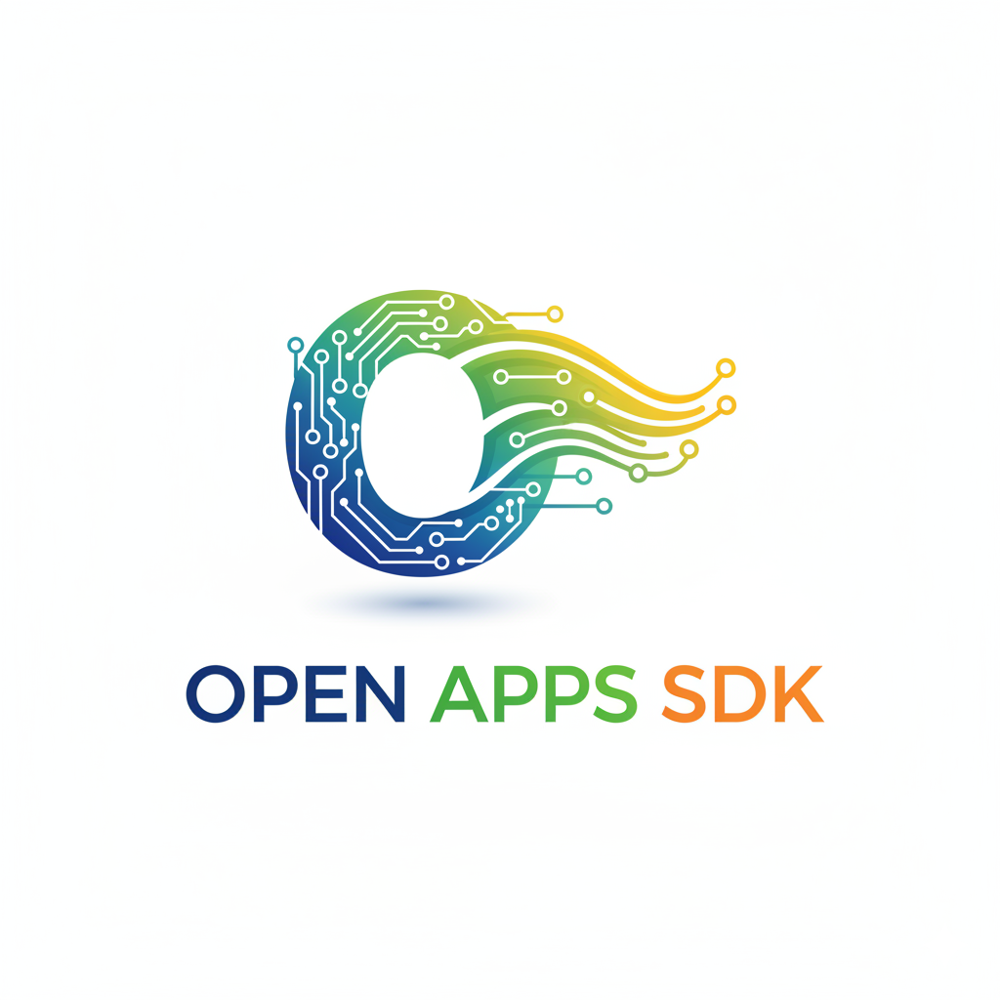
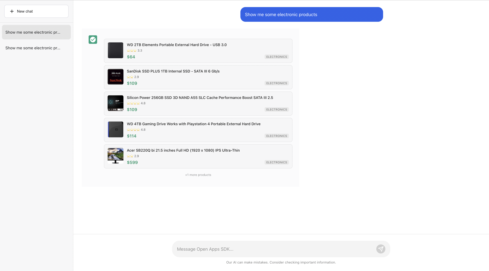
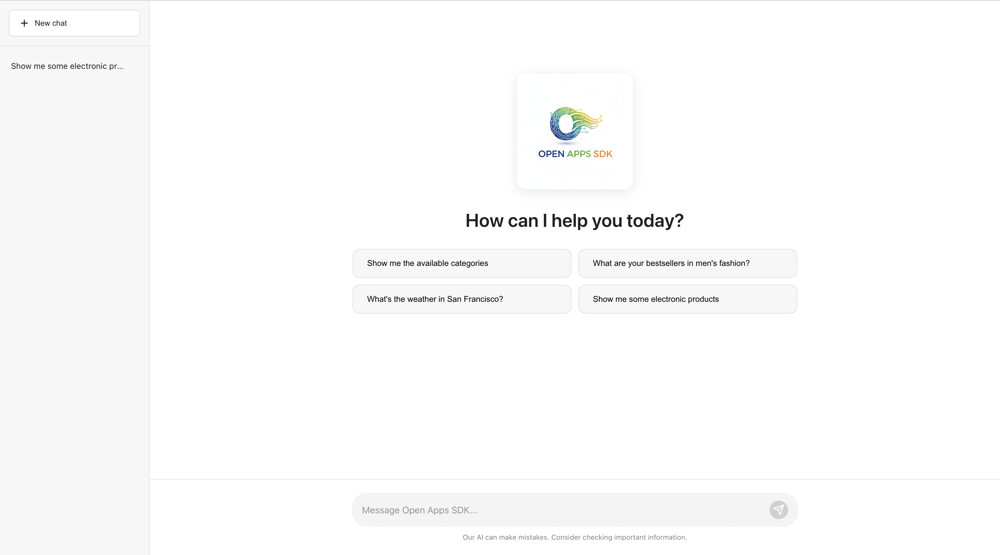

# Open Apps SDK



> Build LLM-agnostic conversational apps with custom UI components and MCP (Model Context Protocol) servers.

## 🌟 Overview

The Open Apps SDK is a framework for building rich, interactive applications that work with **any LLM** (Claude, GPT, Gemini, etc.) while maintaining full control over your UI components and data.

### Key Features

- ✅ **LLM-Agnostic**: Works with Claude, GPT, Gemini, or any other LLM
- ✅ **Custom UI Components**: Build and own your React components
- ✅ **MCP Integration**: Connect to multiple MCP servers
- ✅ **Flexible Loading**: Components via registry, URL, or bundled code
- ✅ **Type-Safe**: Full TypeScript support
- ✅ **Bun-Powered**: Fast builds and hot reloading

## 🚀 Quick Start

### Setup

```bash
# Clone the repository
git clone https://github.com/maneeshsandra/open-apps-sdk.git
cd open-apps-sdk

# Run setup script (installs dependencies and configures environment)
bun run setup

# Start development server
bun run dev
```

### Configuration

The application is configured through two main files:

1. **`.env`** - Environment variables for LLM provider, API keys, etc.
2. **`mcp.config.json`** - MCP server configurations

#### Environment Variables (.env)

```bash
# LLM Configuration
LLM_PROVIDER=lmstudio  # or openai, anthropic, etc.
LLM_API_KEY=your_api_key_here
LLM_BASE_URL=http://127.0.0.1:1234/v1  # For LM Studio
LLM_MODEL=qwen/qwen3-14b
LLM_MAX_TOKENS=4096
LLM_TEMPERATURE=0.7

# Server Configuration
PORT=3000
```

#### MCP Configuration (mcp.config.json)

```json
{
  "mcpServers": {
    "weather-server": {
      "command": "bun",
      "args": ["examples/mcp-servers/weather-server.ts"],
      "transport": "stdio"
    },
    "ecommerce-server": {
      "command": "bun", 
      "args": ["examples/mcp-servers/ecommerce-server.ts"],
      "transport": "stdio"
    }
  }
}
```

### Component Configuration

Update `components.config.js` to register your custom components:

```javascript
import { MyComponent } from './components/MyComponent';

export const components = {
  'my-component': {
    component: MyComponent,
    tools: ['my_tool_name']
  }
};
```

### Create Your First Component

```typescript
// components/MyComponent.tsx
import { useComponentContext, useCallTool, useToolOutput } from 'open-apps-sdk';

export function MyComponent() {
  const { toolOutput, callTool, theme } = useComponentContext();
  const output = useToolOutput(); // Alternative hook
  const callToolFn = useCallTool(); // Alternative hook
  
  const handleAction = async () => {
    // Call MCP tool with authentication headers
    await callTool('my_tool', { 
      param: 'value' 
    }, {
      'Authorization': 'Bearer token',
      'X-API-Key': 'api-key'
    });
  };
  
  return (
    <div className={`my-component ${theme}`}>
      <h2>{toolOutput?.title || output?.title}</h2>
      <button onClick={handleAction}>
        Call Tool
      </button>
    </div>
  );
}
```

### Build an MCP Server

```typescript
// examples/mcp-servers/my-server.ts
import { Server } from '@modelcontextprotocol/sdk/server/index.js';
import { StdioServerTransport } from '@modelcontextprotocol/sdk/server/stdio.js';
import { CallToolRequestSchema, ListToolsRequestSchema } from '@modelcontextprotocol/sdk/types.js';

const server = new Server({
  name: 'my-server',
  version: '1.0.0',
}, {
  capabilities: { tools: {} }
});

// Define available tools
server.setRequestHandler(ListToolsRequestSchema, async () => {
  return {
    tools: [{
      name: 'my_tool',
      description: 'Description of what this tool does',
      inputSchema: {
        type: 'object',
        properties: {
          param: { type: 'string' }
        },
        required: ['param']
      },
      _meta: {
        componentId: 'my-component', // Links to your React component
        componentAccessible: true
      }
    }]
  };
});

// Handle tool calls
server.setRequestHandler(CallToolRequestSchema, async (request) => {
  const { name, arguments: args } = request.params;
  
  if (name === 'my_tool') {
    // Process the tool call
    const result = { title: 'Tool Result', data: args };
    
    return {
      content: [{ type: 'text', text: 'Tool executed successfully' }],
      structuredContent: result, // Passed to component via useToolOutput
      _meta: {
        componentId: 'my-component'
      }
    };
  }
});

// Start the server
const transport = new StdioServerTransport();
server.connect(transport).catch(console.error);
```


## 🎯 Examples

### E-commerce Store

A full-featured shopping experience with product browsing, cart management, and checkout.

```bash
# Start the e-commerce MCP server
bun run examples/mcp-servers/ecommerce-server.ts
```

**Features:**
- Product catalog with categories
- Shopping cart CRUD operations
- User authentication
- Order management

---

## 📸 Screenshots

### Example 1: Component Registry


### Example 2: E-commerce Store


---

## 🧩 Component Hooks

Our SDK provides powerful hooks for building interactive components. See [detailed hooks documentation](./docs/hooks.md) for comprehensive examples and best practices.

### Core Hooks

```typescript
// All-in-one context hook
const {
  toolInput,        // Arguments passed to the tool
  toolOutput,       // Structured data from tool responses
  componentState,   // Persistent component state
  theme,           // Current theme ('light' | 'dark')
  displayMode,     // Display mode ('inline' | 'modal' | etc.)
  callTool,        // Call MCP tools with optional auth headers
  setComponentState, // Update persistent state
  sendMessage,     // Send followup messages to conversation
} = useComponentContext();

// Individual hooks for specific needs
const input = useToolInput();           // Get tool arguments
const output = useToolOutput();         // Get tool response data
const [state, setState] = useComponentState(); // Manage state
const theme = useTheme();               // Get current theme
const callTool = useCallTool();         // Call tools with auth
```

### Authentication & Headers

Pass authentication headers when calling tools:

```typescript
const callTool = useCallTool();

await callTool('authenticated_tool', { 
  param: 'value' 
}, {
  'Authorization': 'Bearer your-token',
  'X-API-Key': 'your-api-key',
  'Content-Type': 'application/json'
});
```

### State Management

Components can maintain persistent state across interactions:

```typescript
const [cartItems, setCartItems] = useComponentState([]);

const addToCart = (item) => {
  setCartItems(prev => [...prev, item]);
};
```

## 🤝 Contributing

We welcome contributions! Please read our [contributing guidelines](./CONTRIBUTING.md) before getting started.

**Quick Start:**
1. Understand the [project intent](./CONTRIBUTING.md#understanding-the-project-intent)
2. [Create an issue](https://github.com/maneeshsandra/open-apps-sdk/issues) first
3. Create a feature branch
4. Make your changes
5. Submit a pull request


## 🐛 Known Issues

See [TROUBLESHOOTING.md](./TROUBLESHOOTING.md) for common issues and solutions.

## 📄 License

MIT License - see [LICENSE](./LICENSE) for details.


---

**Built with ❤️ by the Open Apps SDK team**

[⭐ Star us on GitHub](https://github.com/maneeshsandra/open-apps-sdk) | [📚 Read the docs](./docs/)